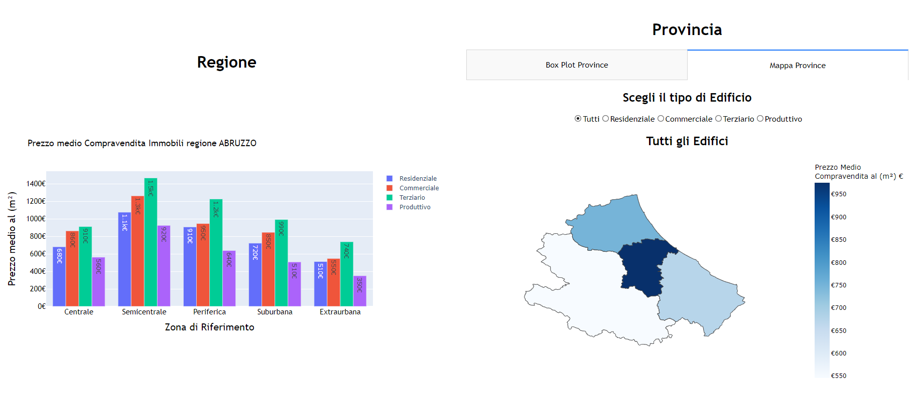

# Project Scientific and Large Data Visualization
Analysis of real estate distribution in Italy across the national territory, considering granularity ranging from regions to municipalities.
The project was developed using the Plotly library in Python and the Dash library to create an interactive web app.

##  Dataset
The dataset considered comes from the Reserved Area of the Italian Revenue Agency and consists of OMI (Osservatorio Mercato Immobiliare) prices for the second half of 2023, referring to all properties.
Within the website, there is an initial, more detailed description of the dataset.
## To Execute
To run, you simply need to have Python installed along with the libraries pandas, plotly, and dash. To execute: python3 myWebapp.py.

